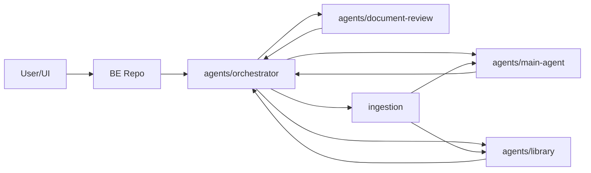

# AX-Prontier AI

메타 에이전트 기반 대학 정보 통합 시스템의 AI 작업 레포입니다.

FE와 BE 실행 레포는 별도로 관리합니다. 이 저장소는 에이전트 로직, RAG 파이프라인, 크롤링/임베딩, 프롬프트, API 계약 초안을 관리합니다.

## Folder Structure

```text
.
├── agents/
│   ├── orchestrator/         # 질의 분류, 라우팅, 에이전트 실행 제어
│   ├── main-agent/           # 학교 정보 QA, 일반 질의 RAG
│   ├── document-review/      # 전자결재 본문 검토 AI
│   └── library/              # 학술정보관 AI + 도서 검색
├── ingestion/
│   ├── crawlers/             # 한성 공지, 학술정보관 크롤러
│   ├── chunking/             # 문서 청킹
│   ├── embedding/            # 임베딩 생성/저장
│   ├── jobs/                 # 수집/재색인 작업
│   └── tests/
├── shared/
│   ├── contracts/            # BE와 맞출 API 요청/응답 스키마
│   ├── llm/                  # 공통 LLM/임베딩 호출 래퍼
│   ├── logging/              # query_id, trace_id 로그 보조
│   └── utils/                # 정말 공통인 유틸만
├── data/
│   ├── raw/                  # 원본 크롤링 데이터
│   ├── processed/            # 정제/청킹 완료 데이터
│   ├── samples/              # 테스트용 샘플 JSON/MD/CSV
│   └── schemas/              # 데이터 스키마 초안
├── docs/
│   ├── architecture/         # 구조, context map, ERD, API/event 계약
│   └── planning/             # 주차별 일정, 회의록, 기획 문서
└── scripts/                  # 개발/운영 보조 스크립트
```

## Agent Layout

에이전트 폴더는 각 기능에 맞게 최대한 직관적인 이름을 사용합니다.

```text
agents/orchestrator/
├── api/          # BE와 연결할 query/route 계약 초안
├── routing/      # 질의 분류, 대상 에이전트 선택
├── pipeline/     # 에이전트 실행 순서, fallback 흐름
├── prompts/      # 라우팅/의도분석 프롬프트
└── tests/

agents/main-agent/
├── api/          # 일반 학교 정보 QA 계약 초안
├── pipeline/     # 검색 -> 생성 -> 출처 정리 흐름
├── prompts/      # 학교 정보 QA 프롬프트
├── retrieval/    # RAG 검색, 캐싱, rerank 등
└── tests/

agents/document-review/
├── api/          # 문서 검토 API 계약 초안
├── rules/        # 문서 규칙, 유형, 검토 기준
├── prompts/      # 검토/수정 제안 프롬프트
├── reviewer/     # 두문/본문/결문 검토 로직
└── tests/

agents/library/
├── api/          # 도서관 QA, 도서 검색 API 계약 초안
├── book-search/  # 도서 CSV/DB 검색, 인덱스
├── qa/           # 학술정보관 안내 RAG
├── prompts/      # 도서관 AI 프롬프트
└── tests/
```

## Responsibilities

### Orchestrator

담당: 개발자 A

- 사용자 질의 수신
- 의도 분석 및 라우팅
- 대상 에이전트 선택
- 서브 에이전트 실행 제어
- fallback 처리
- query_id, trace_id 기반 실행 흐름 관리

### Main Agent

담당: 개발자 A

- 학교 정보 RAG 질의 파이프라인
- JSON/Markdown 크롤링 데이터 기반 검색
- 공식 정보 요약 및 출처 링크 제공
- 서버 임베딩, 캐싱, 검색 속도 개선

### Document Review Agent

담당: 개발자 B

- 전자결재 문서 규칙 관리
- 문서 유형별 검토
- 두문/본문/결문 구조 점검
- 수정 제안 생성
- 규칙 버전 및 검토 결과 관리

### Library Agent

담당: 개발자 C

- 학술정보관 안내 QA
- 도서 메타데이터 검색
- 도서 검색 결과 설명
- 추천/설명 결과 생성

### Ingestion

담당: 개발자 B 또는 C

- 한성대학교 공지 6개월 크롤링
- 학술정보관 전체 6개월 크롤링
- JSON/Markdown 크롤링 데이터 정제
- chunking
- embedding
- 증분 업데이트
- 수집 작업 이력 관리

## Boundary Rules

- 에이전트끼리 서로의 DB 테이블을 직접 참조하지 않습니다.
- 연동은 BE API 계약 또는 이벤트 계약을 기준으로 합니다.
- 공유 가능한 공통 키는 `query_id`, `user_id`, `trace_id`로 제한합니다.
- 공통 타입과 API 계약은 `shared/contracts`에 둡니다.
- LLM 호출 공통 래퍼는 `shared/llm`에 두되, 각 에이전트의 프롬프트는 반드시 자기 폴더의 `prompts`에 둡니다.
- 외부 LLM 전송 전 마스킹은 Main Agent에서 1차 처리하고, Document Review Agent에서 2차 검증합니다.

## Flow



## Initial Milestone

| 영역 | 1주차 (5/6~5/13) | 2주차 (5/13~5/20) |
| --- | --- | --- |
| 메인 오케스트레이터 | 라우팅 기준, 계약, query/trace 흐름 설계 | 서브 에이전트 연결 및 fallback 보완 |
| 메인 에이전트 | JSON/Markdown 크롤링 데이터 수신, 질의 파이프라인 구축 | 서버 임베딩, 응답 속도 보완, 캐싱 전략 검토 |
| 도서 에이전트 | RAG 파이프라인 구축, ERD 정제 | API 완성 및 Core 연결 |
| 문서 에이전트 | 문서 규칙 데이터 구조 설계, 검토 항목 정의 | 검토 API 초안 및 수정 제안 흐름 구축 |
| 크롤링 | 한성 공지 6개월, 학술정보관 전체 6개월 크롤링 | 증분 수집, 청킹, 임베딩 상태 관리 |
