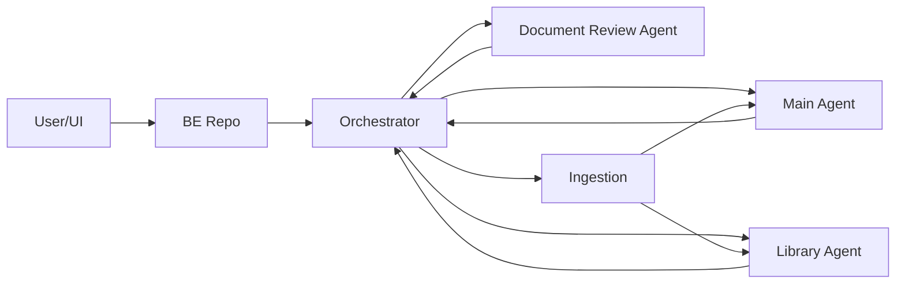

# Context Map

이 저장소는 FE/BE 실행 레포와 분리된 AI 작업 레포입니다. BE는 사용자 요청을 받고, 이 저장소의 에이전트 계약을 기준으로 오케스트레이터와 각 에이전트를 호출합니다.

## Flow

## Responsibilities

| Area | Responsibility |
| --- | --- |
| `agents/orchestrator` | 질의 분류, 라우팅, 실행 흐름 제어, fallback |
| `agents/main-agent` | 학교 공지/학사/일반 정보 RAG 응답 |
| `agents/document-review` | 전자결재 본문 규칙 검토, 수정 제안 |
| `agents/library` | 학술정보관 안내 QA, 도서 검색/설명 |
| `ingestion` | 크롤링, 청킹, 임베딩, 증분 갱신 |
| `shared` | 공통 계약, LLM 래퍼, 로그 보조 |

## Boundary Rules

- 에이전트 간 DB 테이블 직접 참조를 금지합니다.
- 연동은 BE API 계약 또는 이벤트 계약을 기준으로 합니다.
- 공유 키는 `query_id`, `user_id`, `trace_id`로 제한합니다.
- 프롬프트는 각 에이전트의 `prompts`에 둡니다.
- 공통 LLM/임베딩 호출 래퍼만 `shared/llm`에 둡니다.
- 외부 LLM 전송 전 마스킹은 Orchestrator에서 1차, Document Review Agent에서 2차로 수행합니다.

## Data Ownership

| Owner | Data |
| --- | --- |
| Orchestrator | 라우팅 이력, 실행 흐름, trace |
| Main Agent | 학교 정보 검색 결과, 응답 생성 기록 |
| Document Review Agent | 문서 규칙, 규칙 버전, 검토 결과, 수정 제안 |
| Library Agent | 학술정보관 안내 문서, 도서 메타데이터, 검색 로그 |
| Ingestion | 수집 소스, 원문 문서, 청크, 임베딩 상태, 동기화 상태 |

